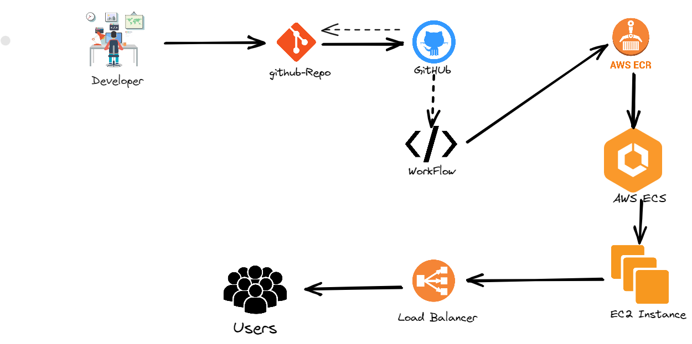
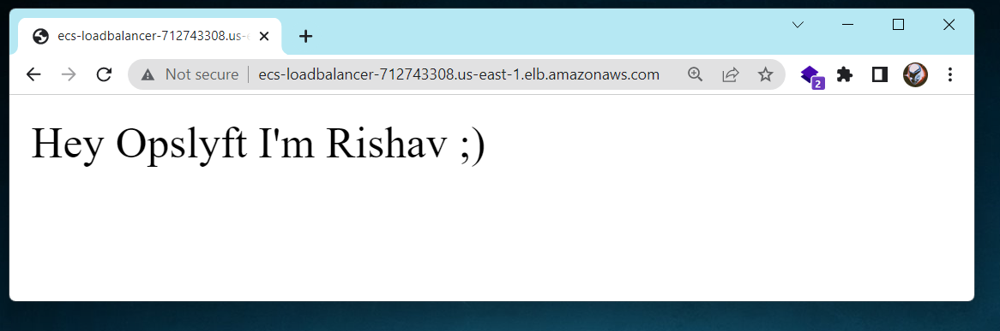

### Develop a simple CI/CD pipeline which builds a docker container and runs it on AWS ECS which is configured Load-balancing.

Tool and Techlogies used:
- Flask
- GitHub Repo
- GitHub Actions
- AWS(IAM, EC2, ECR, ECS, ALB, SG, TG)

#### Tasks:
  This is separated in 3 Stages:

- Create necessary AWS components
- Code simple "Hey Opslyft I'm Rishav ;)" [Flask app](https://github.com/rishavmehra/Flask-ECS/blob/main/app.py)
- Dockerize Flask app
- Push flask app to github
- Create CI/CD Workflow using GitHub Actions

#### Stage 1: Dockerization  

 Click for stage details! 

Dockerize a simple "Hey Opslyft I'm Rishav ;)" Flask Application which responds with a message that is set up as an environment variable and deploy the docker image to AWS ECR.

#### Stage 2: CI/CD Pipeline

 Click for stage details! 

Develop a CI/CD pipeline(Github Actions) which would link the python code and push the updated image to ECR

#### Stage 3: Deployment to ECS

 Click for stage details! 

Setup a workflow which would deploy the given ECR image to ECS on EC2 instance

- Workflow used : [Deploying to Amazon Elastic Container Service](https://docs.github.com/en/actions/deployment/deploying-to-your-cloud-provider/deploying-to-amazon-elastic-container-service)

##### ***Result after all Stage running successfully***

For Live Demo Click on it [50.17.179.189:5000](http://50.17.179.189:5000)
Note : Link will be expire soon

